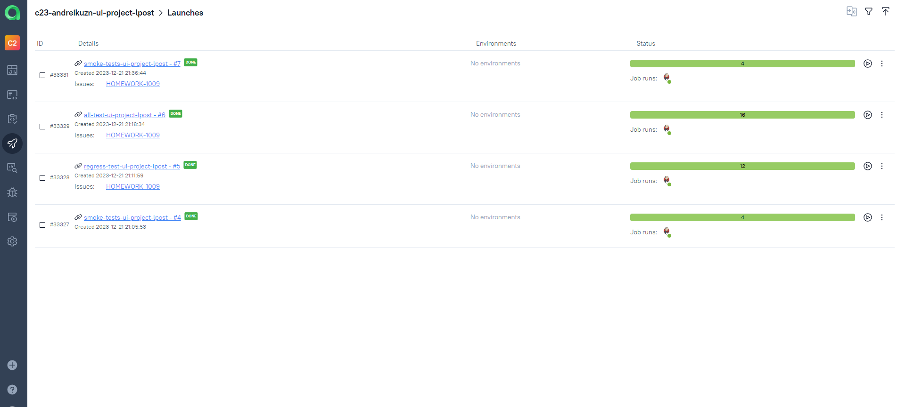

# UI автотесты для сайта https://l-post.ru/

## Cписок автоматизированных тест-кейсов в данном проекте:

- [x] Проверка, что все элементы в header страниц имеют правильные ссылки и отображаются  
- [x] Проверка, что все элементы в основном меню страниц имеют правильные ссылки и отображаются 
- [x] Проверка, что блоки с информацией на страницах сайта имеют названия и содержат контент
- [x] Проверка, что поиск по номеру посылки дает верный результат и правильно отображается 
- [x] Проверка, что расчет стоимости перевозки дает верный результат и правильно отображается
- [x] Проверка выполнения поиска ПВЗ в городе и выдачи правильного результата 
- [x] Проверки, что все элементы в footer страниц имеют правильные ссылки и отображаются  

## Стек технологий:


Java, Gradle, JUnit5, Selenide, Jenkins, Selenoid, Allure Reports, Telegram (уведомления), Jira, TestOps

### Для запусков автотестов используется Jenkins.

##### Примеры готовых сборок можно посмотреть [по ссылке](https://jenkins.autotests.cloud/job/c23-andreikuzn-ui-project-lpost/)

### Используемые параметры сборки Jenkins:

* BROWSER (браузер, по умолчанию chrome)
* BROWSER_VERSION (версия браузера, по умолчанию 100.0)
* REMOTE_URL (адрес удаленного сервера, на котором будут выполняться тесты)
* BROWSER_SIZE (размер окна браузера, по умолчанию 1920x1080)
* TASK (набор тестов (all, smoke, regerss) для запуска)
* BASE_URL (адрес основной страницы тестируемого сайта)

### Запуск тестов из терминала

```bash
gradle clean all_tests
gradle clean smoke_tests
gradle clean regress_tests
```

### Запуск тестов в Jenkins

##### Открыть сборку Jenkins [по ссылке](https://jenkins.autotests.cloud/job/c23-andreikuzn-ui-project-lpost/)
##### Нажать на кнопку "Собрать с параметрами"


##### Выбрать параметры, нажать на кнопку "Собрать"


##### Дождаться выполнения сборки. нажать на кнопку "Allure Report"


### Анализ результатов запусков в Jenkins через Allure Reports


### Для отображения результатов сборок также используется Allure TestOps.

##### Примеры запусков и их результаты можно посмотреть [по ссылке](https://allure.autotests.cloud/project/3888/dashboards)

### Пример списка тестов и их прохождения в Allure TestOps


### Результаты запусков Launches в Allure TestOps



### Основной Dashboards


### Добавлена интеграция с Jira, где можно посмотреть запускаемые кейсы и их результаты.

##### Перейти в Jira можно [по ссылке](https://jira.autotests.cloud/browse/HOMEWORK-1009)


### После прохождения тестов в telegram канал приходит оповещение с результами.


### Пример прохождения тестов можно посмотреть на видео


